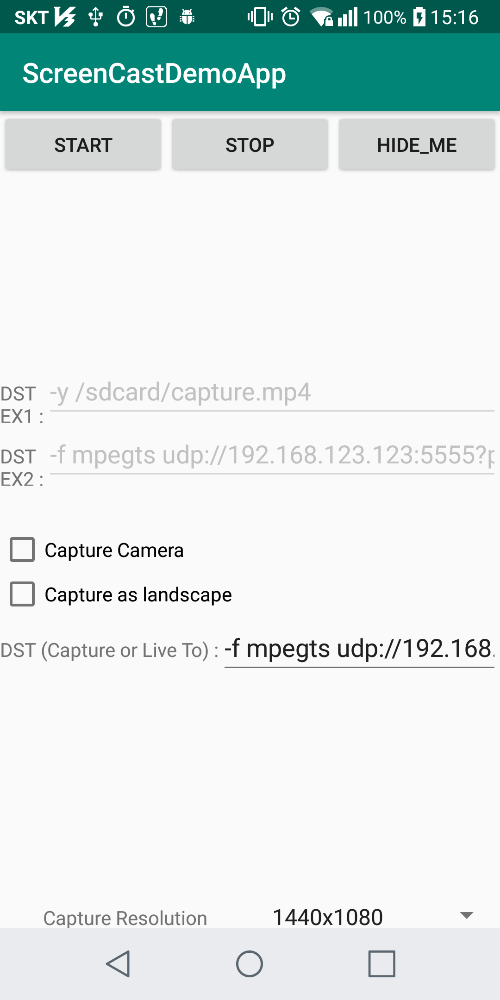
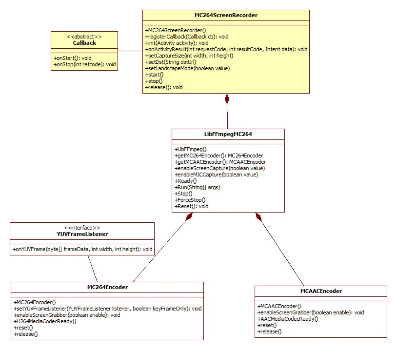

ScreenCastDemo
==============

This is a FFmpeg 4.0 android library demo built over android MediaCodec Encoders(H.264, AAC). 
You - as a developer - can easily cast android screen with this library to Network (RTSP, RTMP, UDP, ...) including File.

<pre>
You can mirror your Android device screen to a PC or a SmartTV.
The RTP unicast is more stable than UDP unicast.

1) For RTP, ScreenCastDemo options can be :
    -f rtp -sdp_file /mnt/sdcard/rtp.sdp rtp://your_pc_ip:port
    ex) -f rtp -sdp_file /mnt/sdcard/rtp.sdp rtp://192.168.10.10:1234
Press START button, then after about 15-seconds later the screen cast will begin.
And the sdp_file - /mnt/sdcard/rtp.sdp - is generated in your Android device.
Take out the rtp.sdp file to your PC and remove the top line which contains 'SDP:'.
And play the rtp.sdp file with VLC player.

2) For UDP, ScreenCastDemo options can be :
    -f mpegts udp://your_pc_ip:port?pkc_size=1316
    ex) -f mpegts udp://192.168.10.10:1234?pkt_size=1316
Press START button, then after about 15-seconds later the screen cast will begin.
And play VLC in your PC with udp://@192.168.10.10:1234 or just udp://@:1234.
</pre>

## The APIs you have to know : 

### prepare an instance
* mMC264Recorder = new MC264ScreenRecorder();
* mMC264Recorder.registerCallback( new MyMC264RecorderCallback() );
* mMC264Recorder.init( this );
* mMC264Recorder.onActivityResult(requestCode, resultCode, data); -- for targetSdkVersion 28 or below
* mMC264Recorder.startProjection(int resultCode, Intent data);    -- for targetSdkVersion 29 or above within foreground service
* mMC264Recorder.setCaptureSize( mDisplayWidth, mDisplayHeight );
* mMC264Recorder.setDst(capDstStr);
* mMC264Recorder.setLandscapeMode(true/false);

### start
* mMC264Recorder.start();

### stop
* mMC264Recorder.stop();

### release
* mMC264Recorder.release();

## Screenshot

  

* This App on google play : https://play.google.com/store/apps/details?id=com.iocaster.screencastdemoapp
 
* Othre Demo App on google play : https://play.google.com/store/apps/details?id=com.iocaster.ffmpegmc264demoapp

## Class Diagram

  

 
 

